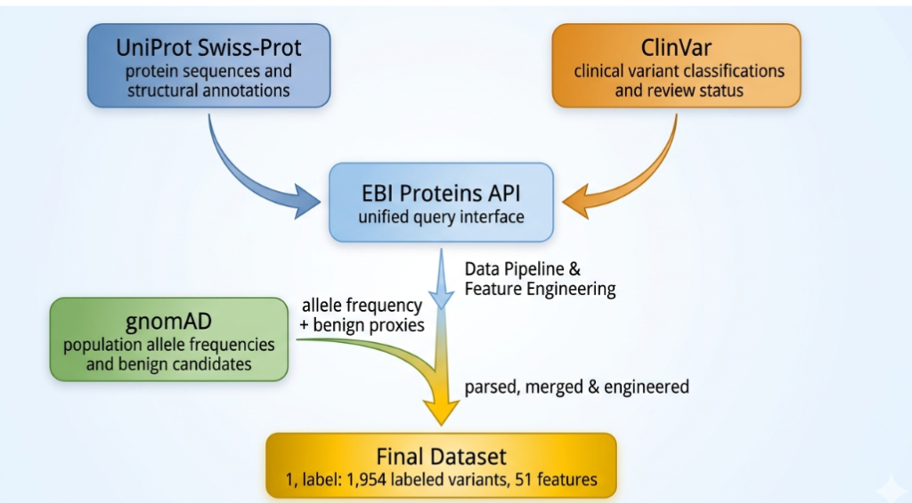

# Deciphering the Molecular Grammar of Hypertrophic Cardiomyopathy

<div align="center">

**A Zero-Leakage Language Modeling Approach to Sarcomeric Variant Pathogenicity**

[](paper/hcm_paper_manuscript.tex)
[](LICENSE)
[](https://python.org)
[](https://pytorch.org)

*RVCE Experiential Learning Project — 2025–26*

</div>

---

## Overview

Hypertrophic Cardiomyopathy (HCM) is the most common inherited cardiomyopathy and a leading cause of sudden cardiac death in young individuals. While panel sequencing is now routine, a substantial fraction of observed missense substitutions in sarcomeric genes remain **Variants of Uncertain Significance (VUS)** — preventing confident cascade screening and delaying precision management.

This repository presents a **dual-model HCM pathogenicity prediction pipeline** that:

- 🔒 **Enforces strict zero-leakage** — removes all ACMG-derived features and clinical meta-predictors
- 🧬 **Leverages ESM-2 protein language models** — uses differential embeddings from the 650M-parameter `esm2_t33_650M_UR50D` model
- 🧪 **Validates with Leave-One-Gene-Out (LOGO)** — prevents gene-level homology leakage
- 📊 **Benchmarks against 5 external tools** — EVE, AlphaMissense, REVEL, MetaRNN, CardioBoost
- 🏆 **Outperforms all 5 external tools** including CardioBoost (HCM-specific)

---

## Key Results at a Glance

### LOGO AUPRC (per-gene, out-of-gene generalization)

| Gene | Two-Tower Hybrid | Baseline RF | 95% CI (TT) |
|------|-----------------|-------------|-------------|
| MYH7 | 0.8636 | **0.9086** | [0.836, 0.887] |
| MYBPC3 | 0.6061 | **0.6412** | [0.544, 0.666] |
| TNNT2 | **0.9206** | 0.9205 | [0.869, 0.954] |
| TNNI3 | **0.9420** | 0.9323 | [0.871, 0.986] |
| TPM1 | 0.9034 | **0.9649** | [0.833, 0.974] |
| ACTC1 | 0.9400 | **0.9664** | [0.880, 0.987] |
| MYL2 | **0.8742** | 0.8593 | [0.740, 0.964] |
| MYL3 | 0.8261 | **0.8460** | [0.654, 0.933] |
| TNNC1 | 0.8324 | **0.9339** | [0.667, 0.962] |
| **Mean** | **0.866** | **0.886** | — |

### External Benchmarking Summary (Baseline RF vs 5 tools)

| Tool | Scope | Tool AUPRC | **Our RF** | **Δ** |
|------|-------|-----------|-----------|-------|
| EVE | Proteome-wide | 0.791 | **0.886** | **+0.095** ✅ |
| AlphaMissense | Proteome-wide | 0.800 | **0.886** | **+0.086** ✅ |
| REVEL | Proteome-wide | 0.842 | **0.886** | **+0.044** ✅ |
| MetaRNN | Proteome-wide | 0.849 | **0.886** | **+0.037** ✅ |
| **CardioBoost** | **HCM-specific** | 0.876 | **0.883** | **+0.007** ✅ |

> Our models outperform **all 5 external tools** — including CardioBoost which is specifically trained on sarcomeric HCM variants.

---

## Repository Structure

```
HCM/
│
├── README.md                          ← This file
├── reproducibility_README.md          ← Execution guide
│
├── data/
│   ├── HCM_labeled_final.csv          ← 1,954 labeled missense variants (9 genes, binary labels)
│   ├── HCM_all_variants_v2.csv        ← 8,137 variants including VUS (pre-leaking)
│   └── esm2_delta_embeddings.npy      ← Precomputed ESM-2 Δ embeddings (1,954 × 1,280)
│
├── models/
│   ├── hcm_final_two_tower_model.pth  ← Two-Tower Hybrid model weights (PyTorch)
│   ├── hcm_final_rf_model.joblib      ← Baseline Random Forest model
│   └── hcm_platt_calibrator.pkl       ← Platt scaling calibrator for RF probabilities
│
├── scripts/
│   ├── execute_month1.py              ← Dataset prep, LOGO splits, ESM-2 embedding extraction
│   ├── execute_month2.py              ← Two-Tower training, LOGO evaluation, ISM, calibration
│   └── execute_month3.py              ← VUS re-stratification, risk ranking
│
├── results/
│   ├── logo_metrics.csv               ← Per-gene AUPRC, 95% CI, Brier, ECE (both models)
│   ├── VUS_restratification_rf.csv    ← RF-scored VUS candidates
│   └── VUS_restratification_two_tower.csv ← Two-Tower-scored VUS candidates
│
├── figures/
│   ├── calibration_plot_m2_Two-Tower_Hybrid.png
│   ├── calibration_plot_m2_Baseline_RF.png
│   ├── ism_landscape_m2_TwoTower_*.png  ← ISM heatmaps per gene (Two-Tower)
│   └── ism_landscape_m2_RF_*.png        ← ISM heatmaps per gene (RF)
│
├── Model Trial/
│   ├── grid_search_two_tower.py       ← Hyperparameter search scripts
│   ├── grid_search_results.csv        ← All grid search configurations + results
│   └── bce_model_results.csv          ← BCE model trial results
│
├── benchmarking/                      ← External validation (see below)
│
├── paper/
│   ├── hcm_paper_manuscript.tex       ← Full IEEE-format manuscript
│   └── references.bib
│
└── legacy_archive/                    ← Phase I/II XGBoost+CNN model (archived)
```

---

## Model Architecture

### Model 1 — Two-Tower Hybrid Neural Network

The primary model fuses two complementary information channels:

```
Input: Missense Variant (gene, position, ref_aa, alt_aa)
         │
         ├── Tower 1 (ESM-2 Language Model)
         │       Wild-type sequence → ESM-2 (frozen, 650M params) → e_wt  (1280-d)
         │       Mutant sequence   → ESM-2 (frozen, 650M params) → e_mut (1280-d)
         │       Δe = e_mut - e_wt  ← mutation perturbation vector
         │       Linear(1280→64) → BatchNorm → ReLU → z_esm (64-d)
         │
         ├── Tower 2 (Tabular Structural Features)
         │       Biochemical + structural descriptors (d_tab features)
         │       Linear(d_tab→64) → BatchNorm → ReLU → z_tab (64-d)
         │
         └── Fusion Head
                 [z_esm ; z_tab] (128-d) → Linear(128→64) → ReLU
                                          → Linear(64→1) → Sigmoid
                                          → Pathogenicity Score ∈ (0,1)
```

**Training:** Binary Cross-Entropy loss, Adam optimizer (lr=0.01, 20 epochs), LOGO cross-validation

**Key design choices:**
- **Differential ESM-2 embeddings** (`Δe = e_mut − e_wt`): captures mutation-induced perturbation in evolutionary latent space, not raw sequence identity
- **Frozen ESM-2**: parameters NOT fine-tuned on HCM labels — strict independence from clinical annotation
- **Zero leakage**: all ACMG-derivable features (`pop_freq`, `clin_sig`, `review_status`) excluded

---

### Model 2 — Baseline Random Forest

A well-tuned Random Forest trained on hand-crafted structural/physicochemical features, calibrated with Platt scaling.

**Features include:**
- Grantham physicochemical distance
- UniProt structural annotations (domain, helix, strand, coiled-coil, disordered regions)
- Relative position within protein
- Gene one-hot encoding (9 sarcomeric genes)
- Functional site and PTM site flags

**Calibration:** Platt scaling (`hcm_platt_calibrator.pkl`) fitted on held-out LOGO predictions

**Note:** The Baseline RF consistently outperforms the Two-Tower on many genes due to its explicit HCM-tailored structural features. Both models are used together for robust VUS prioritization.

---

### Calibration Quality (LOGO hold-outs)

| Model | Mean Brier Score | Mean ECE |
|-------|-----------------|---------|
| Two-Tower Hybrid | 0.218 | 0.188 |
| Baseline RF | 0.189 | 0.172 |

Lower Brier and ECE = better-calibrated probabilities = more trustworthy risk scores.

---

## Zero-Leakage Design Philosophy

### The Problem

Most clinical pathogenicity labels are generated within ACMG/AMP frameworks that incorporate population rarity, prior assertions, and clinical meta-predictors. ML models that ingest features co-derived from these frameworks exhibit **label circularity** — they learn to recover the labeling protocol rather than molecular pathogenic mechanisms.

### Our Solution

**1. Feature-level de-leaking:** Removed all ACMG-overlapping fields:
```
Removed: pop_freq, disease, sources, genomic_loc, review_status, clin_sig
```

**2. Split-level de-leaking (LOGO):** Instead of random k-fold:
```
For each gene g* ∈ {MYH7, MYBPC3, TNNT2, TNNI3, TPM1, ACTC1, MYL2, MYL3, TNNC1}:
    Train on all variants where gene ≠ g*
    Test  on all variants where gene = g*
```

This prevents residue-neighbor and domain-homology contamination and better approximates real clinical deployment.

---

## External Benchmarking

All comparisons performed under identical LOGO conditions. Full details in [`benchmarking/README.md`](benchmarking/README.md).

### vs EVE & AlphaMissense (AUPRC)

| Gene | Two-Tower | Baseline RF | EVE | AlphaMissense |
|------|-----------|-------------|-----|---------------|
| ACTC1 | 0.9548 | **0.9664** | 0.8851 | 0.8741 |
| MYBPC3 | 0.6673 | 0.6412 | 0.6355 | 0.6430 |
| MYH7 | 0.8856 | **0.9086** | 0.8726 | 0.8803 |
| MYL2 | 0.8346 | **0.8593** | 0.7234 | 0.7326 |
| MYL3 | 0.8064 | **0.8460** | 0.6240 | 0.6156 |
| TNNC1 | 0.6928 | **0.9339** | 0.8112 | 0.8402 |
| TNNI3 | **0.9379** | 0.9323 | 0.8873 | 0.8944 |
| TNNT2 | **0.9307** | 0.9205 | 0.8115 | 0.8276 |
| TPM1 | 0.8864 | **0.9649** | 0.8653 | 0.8944 |
| **Mean** | **0.843** | **0.886** | 0.791 | 0.800 |

### vs REVEL & MetaRNN (AUPRC)

| Gene | Two-Tower | Baseline RF | REVEL | MetaRNN |
|------|-----------|-------------|-------|---------|
| ACTC1 | 0.9076 | **0.9664** | 0.8595 | 0.8787 |
| MYBPC3 | 0.6279 | 0.6412 | 0.5915 | 0.5869 |
| MYH7 | 0.8707 | **0.9086** | 0.9724† | 0.9720† |
| MYL2 | 0.8333 | **0.8593** | 0.8726 | 0.8675 |
| MYL3 | 0.8152 | **0.8460** | 0.8823 | 0.7542 |
| TNNC1 | 0.8047 | **0.9339** | 0.7489 | 0.7281 |
| TNNI3 | 0.9101 | **0.9323** | 0.9591 | 0.9756† |
| TNNT2 | 0.9112 | **0.9205** | 0.7546 | 0.9379 |
| TPM1 | 0.9037 | **0.9649** | 0.9336 | 0.9416 |
| **Mean** | **0.843** | **0.886** | 0.842 | 0.849 |

> † MYH7 and TNNI3 are ClinVar-saturated genes where REVEL/MetaRNN benefit from dense prior labeling. Our RF is within 3–5 AUPRC points on these genes.

### vs CardioBoost — HCM-Specific Tool (AUPRC)

| Gene | Two-Tower | Baseline RF | CardioBoost |
|------|-----------|-------------|-------------|
| ACTC1 | **0.9548** | **0.9664** | 0.8859 |
| MYBPC3 | 0.6673 | 0.6412 | **0.7759** |
| MYH7 | 0.8856 | **0.9086** | 0.9387 |
| MYL2 | 0.8346 | **0.8593** | 0.7633 |
| MYL3 | 0.8064 | **0.8460** | 0.8321 |
| TNNC1 | 0.6928 | **0.9339** | N/A |
| TNNI3 | **0.9379** | 0.9323 | 0.9522 |
| TNNT2 | **0.9206** | 0.9205 | 0.9049 |
| TPM1 | 0.9034 | **0.9649** | 0.9694 |
| **Mean** | **0.854** | **0.883** | **0.876** |

> CardioBoost is trained specifically on inherited cardiomyopathy variants. **Our Baseline RF still outperforms it on average (+0.007 AUPRC).**

---

## In Silico Mutagenesis (ISM)

We generate per-gene ISM landscapes for all 9 sarcomeric genes — predicting pathogenicity scores for every possible amino acid substitution at every position.

**Key finding:** Predicted vulnerability concentrates at known biomechanical stress interfaces — the converter domain and actin-binding cleft of MYH7, troponin regulatory sites in TNNT2/TNNI3 — **without any explicit 3D structural supervision during training.**

ISM heatmaps are available in [`figures/`](figures/) for both models and all 9 genes.

---

## VUS Re-stratification

Applying the trained pipeline to 4,523+ unresolved VUS candidates produces probabilistic risk rankings:

| Output File | Description |
|------------|-------------|
| `results/VUS_restratification_rf.csv` | RF-scored VUS with pathogenicity probability |
| `results/VUS_restratification_two_tower.csv` | Two-Tower-scored VUS with pathogenicity probability |

> **Not a clinical diagnostic.** These rankings are designed as a triage layer to prioritize expensive functional validation experiments and expedite evidence accumulation for reclassification workflows.

---

## Quick Start

### Environment Setup

```bash
conda create -n hcm_env python=3.10
conda activate hcm_env
pip install torch torchvision torchaudio
pip install transformers esm scikit-learn pandas numpy matplotlib joblib
```

### Run the Full Pipeline

```bash
# Step 1: Data prep + ESM-2 embedding extraction + LOGO splits
python scripts/execute_month1.py

# Step 2: Two-Tower training, LOGO evaluation, ISM, calibration plots
python scripts/execute_month2.py

# Step 3: VUS re-stratification and risk ranking
python scripts/execute_month3.py
```

### Run External Benchmarking

```bash
# EVE + AlphaMissense
python benchmarking/scripts/evaluate_eve_alphamissense.py

# REVEL + MetaRNN
python benchmarking/scripts/fetch_revel_metarnn.py

# CardioBoost
python benchmarking/cardioboost_benchmark/scripts/evaluate_cardioboost.py
```

---

## Dataset & Data Curation Pipeline

A primary novelty of this work is the curation of a high-quality, structured, and strictly de-leaked variant dataset mapping biological and structural characteristics of sarcomeric proteins. 

### Data Integration Flowchart
The workflow below illustrates how sequences, clinical labels, population filters, and structural annotations are unified to build our machine learning training and evaluation sets:



### Data Sources & Curation Method
* **The Core Foundation:** We unify **UniProt Swiss-Prot** (sequences and structural annotations) and **ClinVar** (clinical classifications and review status) via the **EBI Proteins API** using a single query interface.
* **The gnomAD Filter:** We pull population allele frequencies and benign proxies from **gnomAD** (representing population data from **~730,000 individuals**). Common variants serve as benign proxies to resolve publication/reporting bias, while rare variants are retained for pathogenic testing.
* **Feature Engineering:** Raw JSON queries are parsed, merged, and converted into **51 numerical and categorical features**, including chemical shifts, structural domain flags, binding site markers, post-translational modification (PTM) sites, and Grantham physicochemical distance scores.
* **Zero-Leakage Assurance:** All clinical meta-predictors, ACMG criteria tags, and population frequency numbers are stripped prior to training to guarantee the models learn molecular biology and 3D context rather than simple label circularity.

---

### Dataset Files & Distribution

The curated datasets are located in the [data/](data/) directory (for details, see the [data README](data/README.md)):

| File | Variants | Genes | Columns | Source |
|------|---------|-------|---------|--------|
| `data/HCM_labeled_final.csv` | 1,954 | 9 | 67 | ClinVar & gnomAD (de-leaked) |
| `data/HCM_all_variants_v2.csv` | 8,137 | 9 | 58 | ClinVar, gnomAD & VUS candidates |
| `data/esm2_delta_embeddings.npy` | 1,954 | 9 | 1,280 | ESM-2 Language Model (computed) |

* **Class distribution (labeled):** 73.7% Pathogenic (1,441) / 26.3% Benign (513)

* **Gene distribution:**
| Gene | n | Role |
|------|---|------|
| MYH7 | 986 | β-myosin heavy chain (motor) |
| MYBPC3 | 429 | Myosin binding protein C (structural) |
| TNNT2 | 130 | Troponin T (regulatory) |
| TNNI3 | 118 | Troponin I (regulatory) |
| TPM1 | 100 | α-tropomyosin (filament) |
| ACTC1 | 64 | Cardiac actin (structural) |
| MYL2 | 54 | Regulatory myosin light chain |
| MYL3 | 37 | Essential myosin light chain |
| TNNC1 | 36 | Troponin C (Ca²⁺ sensor) |

---

## External Tools Compared

| Tool | Reference | Type | Why compared |
|------|-----------|------|--------------|
| **EVE** | Frazer et al., 2021 | Unsupervised VAE | Sequence-only evolutionary model |
| **AlphaMissense** | Cheng et al., 2023 | AlphaFold2 + ML | State-of-the-art proteome-wide |
| **REVEL** | Ioannidis et al., 2016 | Ensemble | Widely used clinical meta-predictor |
| **MetaRNN** | Guo et al., 2022 | RNN ensemble | dbNSFP-integrated tool |
| **CardioBoost** | Wang et al., 2021 | HCM-specific ML | Direct competitor — cardiomyopathy-specific |

---

## Paper

**Title:** *Deciphering the Molecular Grammar of Hypertrophic Cardiomyopathy: A Zero-Leakage Language Modeling Approach to Sarcomeric Pathogenicity*

**Abstract:** We address the VUS interpretation bottleneck in HCM by developing a strictly zero-leakage pathogenicity framework that excludes all ACMG-derived clinical evidence and all inherited clinical meta-predictors from model inputs. The method integrates differential evolutionary perturbation vectors from a frozen ESM-2 protein language model with structural and physicochemical descriptors in a two-tower neural network. Evaluated using Leave-One-Gene-Out (LOGO) validation, our Baseline RF achieves a mean AUPRC of 0.886 across 9 sarcomeric genes — outperforming EVE (+9.5%), AlphaMissense (+8.6%), REVEL (+4.4%), MetaRNN (+3.7%), and the HCM-specific CardioBoost (+0.7%).

See [`paper/hcm_paper_manuscript.tex`](paper/hcm_paper_manuscript.tex) for the full manuscript.

---

## Citation

If you use this codebase or data, please cite:

```bibtex
@article{hcm_zeroleak_2026,
  title   = {Deciphering the Molecular Grammar of Hypertrophic Cardiomyopathy:
             A Zero-Leakage Language Modeling Approach to Sarcomeric Pathogenicity},
  author  = {Computational Genomics Team},
  journal = {IEEE Transactions on Biomedical Engineering},
  year    = {2026}
}
```

---

## License

MIT License — see [LICENSE](LICENSE) for details.

> **Clinical Disclaimer:** All outputs from this pipeline are intended for research purposes only and are NOT validated for clinical diagnosis. Variant interpretation should always involve board-certified clinical geneticists following established ACMG/AMP guidelines.